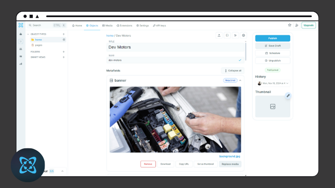

<div style="display: flex; flex-direction: column; text-align: center;">
    <h1>DevMotors - Sistema para mêcanicas</h1>
    
</div>

## Sumário

- [\[DevMotors\]](#)
  - [Sumário](#sumário)
  - [Introdução](#introdução)
  - [Tecnologias Usadas](#tecnologias-usadas)
  - [Snapshots](#snapshots)
  - [Ambiente de desenvolvimento](#ambiente-de-desenvolvimento)
  - [Informações Técnicas](#informações-técnicas)
  - [Como Executar o Projeto](#como-executar-o-projeto)
  - [Contato](#contato)

## Introdução

Landing page para uma oficina mecânica, utilizando Next.js 15 com renderização no servidor, [Cosmic CMS](https://www.cosmicjs.com) para gerenciamento de conteúdo, e TypeScript para tipagem robusta. O projeto adota a abordagem de componetização, criando uma estrutura modular e reutilizável para a interface. O objetivo é explorar as tecnologias mais modernas para otimização de performance e facilidade de manutenção, além de fornecer uma solução prática para gerenciamento de conteúdo sem dependências de desenvolvimento.

## Tecnologias Usadas

&nbsp;
&nbsp;

## Ambiente de desenvolvimento

- Virtual Studio Code - Version 1.96.2
- GitHub Desktop - Version 3.4.12 
- Node.js - Version 22.11.0
- Cosmic CMS

## Informações técnicas

- Utilizado Next 15 com App Router;
- Utilizado TypeScript;
- Feito as requisições e armazenamento Cosmic CMS;
- Utilizado regras e padrões do Prettier;

## Snapshots

### Home


### Serviços


### Contato


### Página de serviço


### Cosmic CMS



### Retorno da API Cosmic CMS


## Como Executar o Projeto

Para executar o projeto siga as instruções:

1. Clone o repositório:

```bash
git clone https://github.com/LucasDoGit/devmotors
cd devmotors
```

2. Instale as dependências:

```bash
npm install
```

4. Crie uma conta no [Cosmic CMS](https://www.cosmicjs.com) e crie os objetos seguindo a tipagem dos modelos na pasta `/src/utils/***.type.ts` ou importe o arquivo `objetos-cosmic.json` (localizado na raiz do projeto) nas configurações do projeto.


3. Crie o arquivo *.env* na raiz do projeto e configure as chaves de acesso ao seu cosmic cms.

```javascript
NEXT_PUBLIC_API_URL= /*url de acesso ao seu projeto do cosmic*/
READ_KEY= /*chave de acesso do seu projeto*/
```

4. use o comando abaixo para iniciar o projeto e aguarde.

```bash
npm run dev
```

5. Feito! O projeto deve ser iniciado e pode ser acesso usando um navegador pela url "http://localhost:3000"

## Contato

Para obter mais informações, entre em contato comigo em:

- Email: lucas.saiz19@gmail.com
- GitHub: https://github.com/LucasDoGit